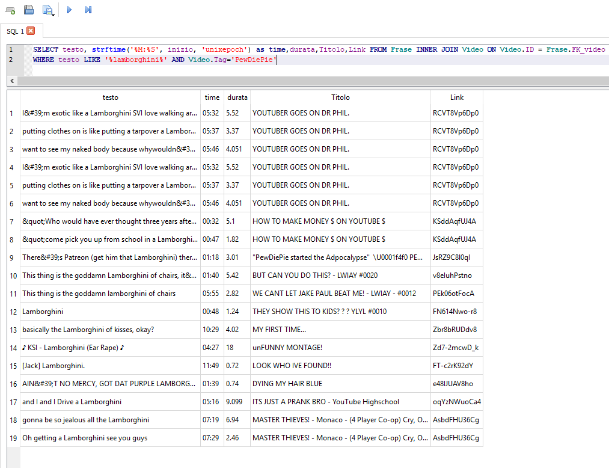

# Youtube subtitles scraper

#### This simple program allow you to download all the phrases with given timestamps said in a playlist of videos

## How to use: 

	1. Find a playlist of video you would like to be saved, for example all the uploads of a youtube channel
	2. Put the id of the playlist in the PlayListURL variable.
	e.g. (https://www.youtube.com/playlist?list=UU-lHJZR3Gqxm24_Vd_AJ5Yw) The id of this playlist is UU-lHJZR3Gqxm24_Vd_AJ5Yw
	3. Start the function GetPlaylist() in your Main.
	4. Once the function finish to harvest all the links needed from the playlist
	   you can finnaly scrape the subtitles.
	5. Change the variable ChannelName to the channel of the videos.
	6. Run the function ScriviFrasi()
	
## Why did you do this? 

#### I have always wondered how difficult youtube mashup were to do like making famous people sing. <br> Hence i created this simple program that allows you do make query on the database knowing exactly which video contains your desidered words 

## How can i find specific words?

###### With query of course
#### You have to download a database browser program like [This](http://sqlitebrowser.org/) <br> After you opened the database with the program you have to go to the section "Execute SQL" <br> Prompt then this command
```
SELECT testo, strftime('%M:%S', inizio, 'unixepoch') as time,durata,Titolo,Link FROM Frase INNER JOIN Video ON Video.ID = Frase.FK_video
WHERE testo LIKE '%Word%' AND Video.Tag='YoutubeChannel';
```
#### Where instead of "Word" you have to write your desired text to search <br> And instead of "Youtube Channel" you write the youtube channel you wan to look up.
## Let's see an example


#### I downloaded all Pewdiepie's video in form of subtitles and i want to look up for fun sake if he says something like Lamborghini 


